# Project 1A: Front End Developer Multi Step Loan Application Form

A production-style React frontend simulation for a responsive multi-step loan application covering Personal, Home, and Business loans.

## Live Project / Repository

**GitHub Repository:**  
https://github.com/kashifshaiq/project-1a-front-end-developer-multi-step-loan-application-form

## Project Overview

This project demonstrates a complete 8-step loan application workflow with:

- Multi-step responsive form navigation
- React Hook Form state management
- Zod validation
- Conditional fields and conditional Step 6
- PAN/Aadhaar verification simulation
- PIN-code based address lookup
- Document upload, preview and image compression
- E-signature capture
- Auto-save and resume
- EMI and pre-approval calculation
- Cross-step validation
- Responsive and accessible UI
- Cypress end-to-end testing

---

## Application Screenshots

### Desktop / Web Screenshots

Add the desktop screenshots for the application steps in the `screenshots/web/` folder.

| Step | Screenshot |
|---|---|
| Step 1 – Loan Type & Basic Information | `images/web/step-01.png` |
| Step 2 – Personal Information | `images/web/step-02.png` |
| Step 3 – KYC / Identity Verification | `images/web/step-03.png` |
| Step 4 – Address Information | `images/web/step-04.png` |
| Step 5 – Employment & Income | `images/web/step-05.png` |
| Step 6 – Co-Applicant & Guarantor | `images/web/step-06.png` |
| Step 7 – Documents & E-Signature | `images/web/step-07.png` |
| Step 8 – Review & Pre-Approval | `images/web/step-08.png` |

### Desktop Screenshot Gallery

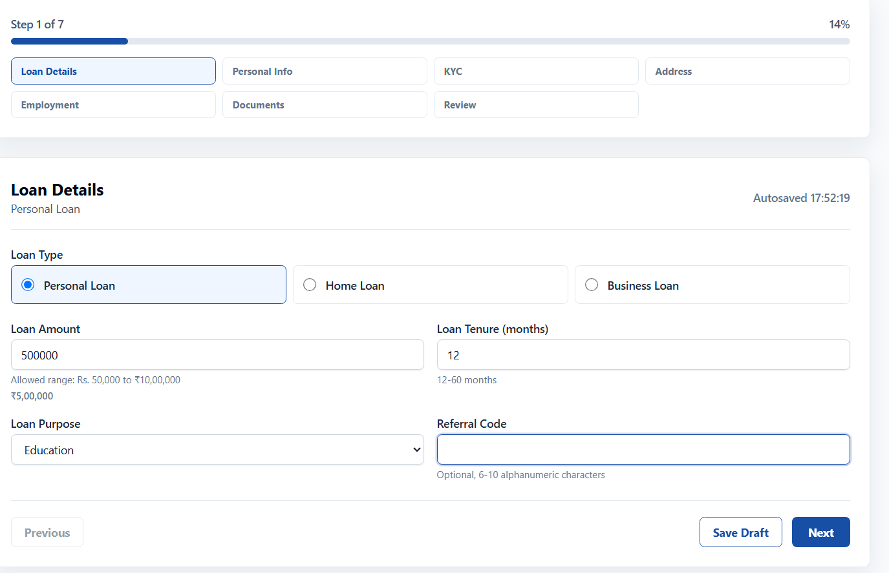

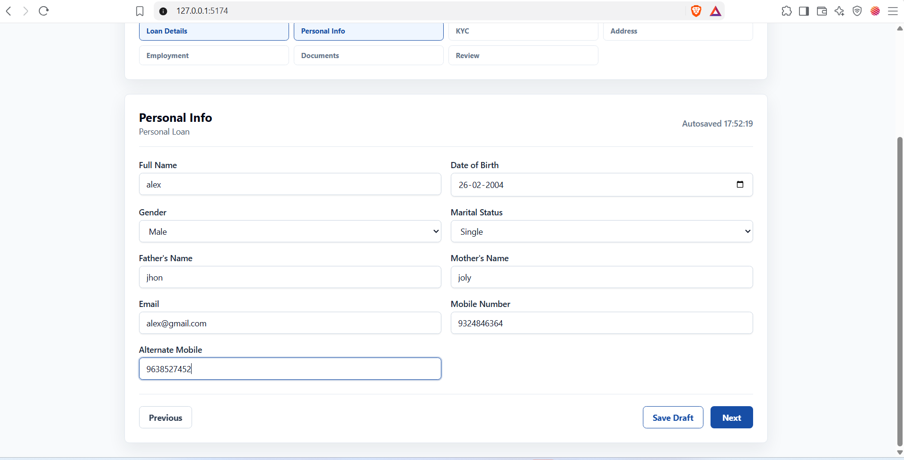

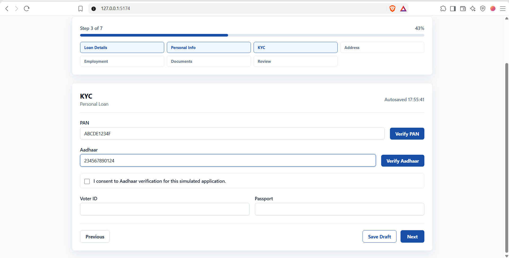

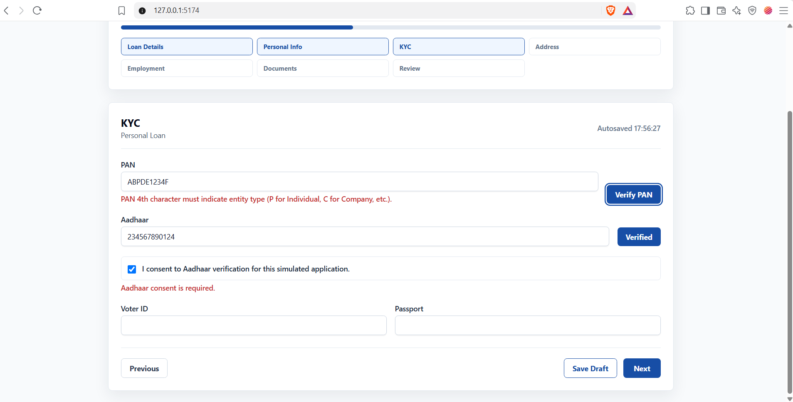

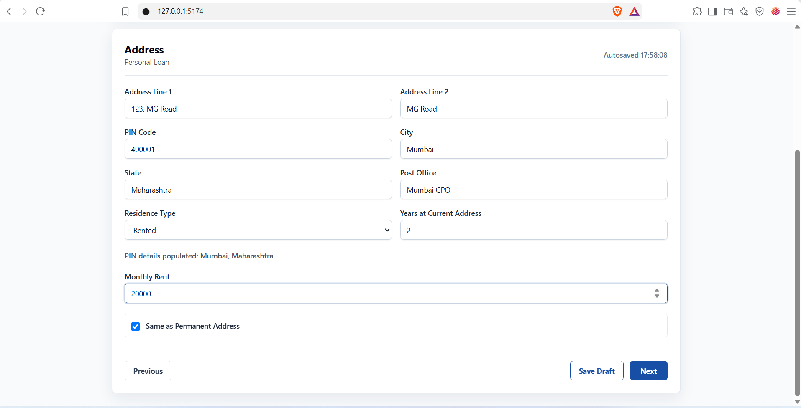

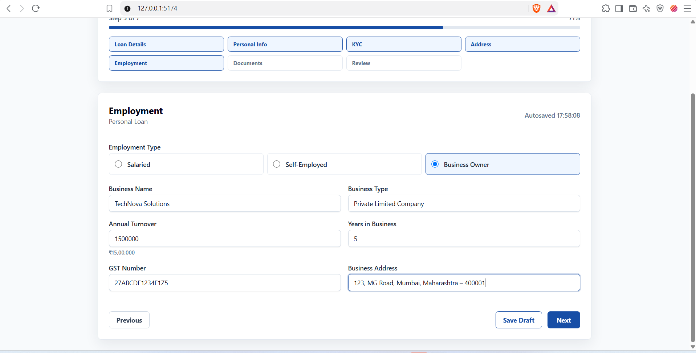

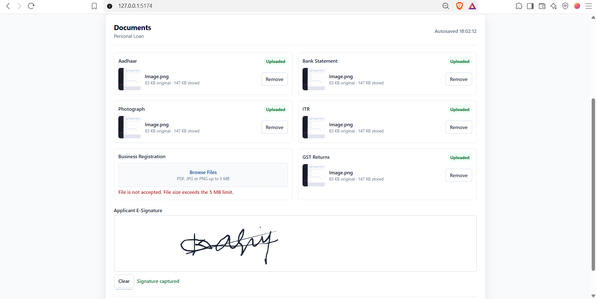

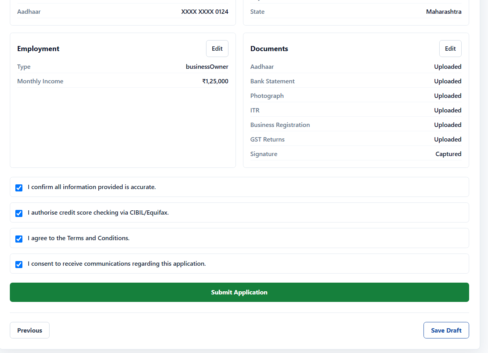
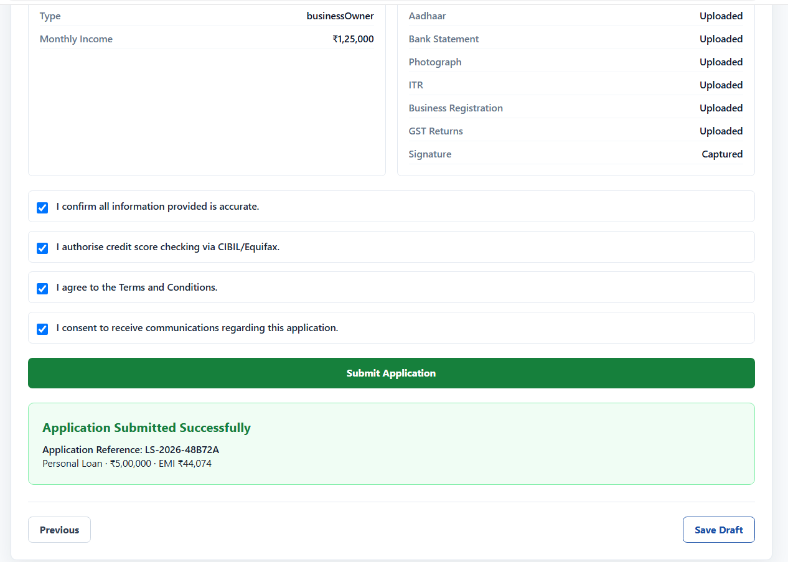

---

### Mobile Screenshots

Add the mobile screenshots for the application steps in the `screenshots/mobile/` folder.

| Step | Screenshot |
|---|---|
| Step 1 – Loan Type & Basic Information | `screenshots/mobile/step-01.png` |
| Step 2 – Personal Information | `screenshots/mobile/step-02.png` |
| Step 3 – KYC / Identity Verification | `screenshots/mobile/step-03.png` |
| Step 4 – Address Information | `screenshots/mobile/step-04.png` |
| Step 5 – Employment & Income | `screenshots/mobile/step-05.png` |
| Step 6 – Co-Applicant & Guarantor | `screenshots/mobile/step-06.png` |
| Step 7 – Documents & E-Signature | `screenshots/mobile/step-07.png` |
| Step 8 – Review & Pre-Approval | `screenshots/mobile/step-08.png` |

### Mobile Screenshot Gallery

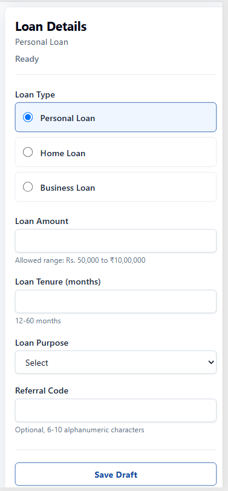

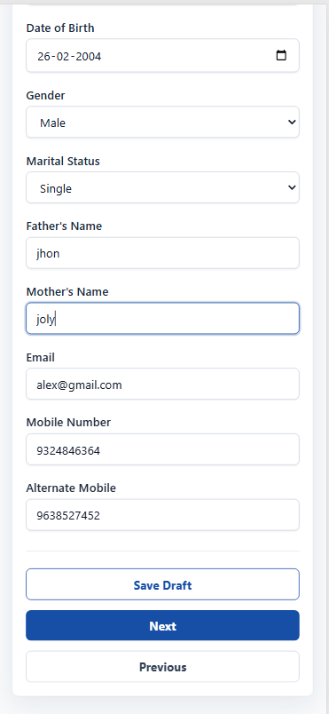

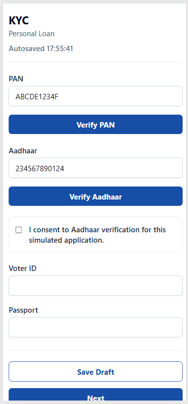

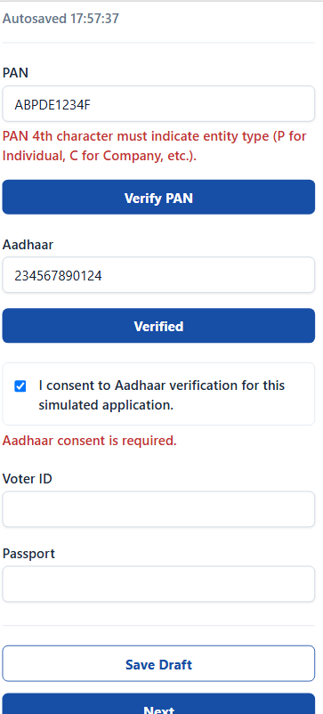

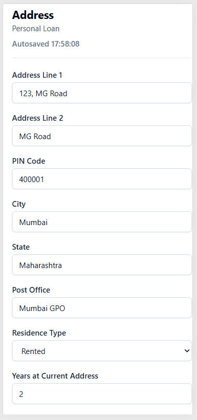

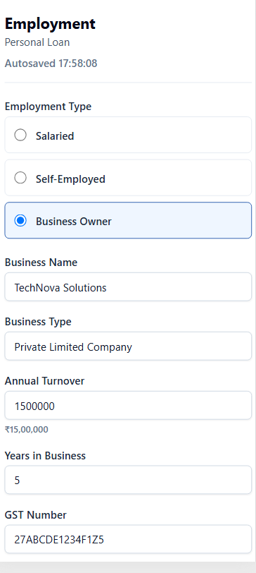

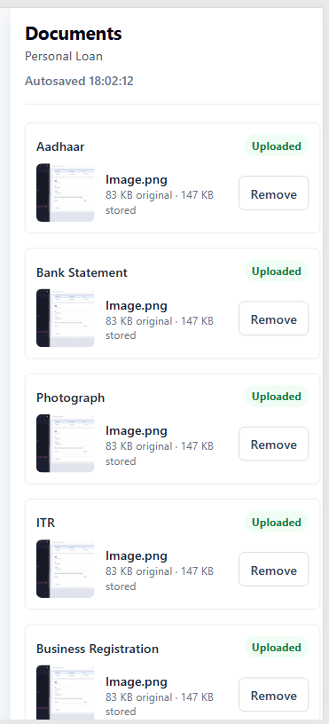
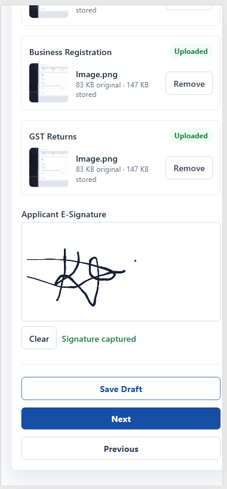


> **Note:** The screenshot paths above are placeholders until the actual screenshots are added to the repository.

---

## Main Loan Types

### Personal Loan
- Maximum simulated amount: ₹10,00,000
- Tenure: 12–60 months
- Interest rate: 10.5% p.a.

### Home Loan
- Maximum simulated amount: ₹1,00,00,000
- Tenure: 60–360 months
- Interest rate: 8.5% p.a.

### Business Loan
- Maximum simulated amount: ₹50,00,000
- Tenure: 12–120 months
- Interest rate: 14% p.a.

---

## 8-Step User Flow

1. Loan Type & Basic Information
2. Personal Information
3. KYC / Identity Verification
4. Address Information
5. Employment & Income
6. Co-Applicant & Guarantor
7. Documents & E-Signature
8. Review, Consent & Pre-Approval

### Conditional Logic

Step 6 is displayed when:

- Personal Loan amount > ₹5,00,000
- Home Loan: always
- Business Loan amount > ₹20,00,000

For Business Loans, employment is restricted to Self-Employed / Business Owner options.

---

## Technology Stack

- React
- Vite
- JavaScript
- Tailwind CSS
- React Hook Form
- Zod
- React Dropzone
- react-signature-canvas
- LocalStorage
- Cypress

---

## Validation

The application includes validation for:

- Loan amount and tenure by loan type
- Applicant age
- Mobile number
- PAN format
- Aadhaar format/checksum
- Aadhaar consent
- Alternate mobile number
- PIN/address consistency
- Employment-specific fields
- Loan/document requirements
- Signature requirement
- Final consent requirements
- Cross-step dependencies

---

## PAN / Aadhaar Verification Simulation

No real government verification API is used.

The frontend simulates:

1. Local input validation
2. Verification state
3. `Verifying...` feedback
4. Successful `Verified` result

This is intentionally a frontend-only simulation.

---

## Address Lookup

The project uses a static local PIN-code dataset.

Examples:

```text
400001 → Mumbai, Maharashtra
110001 → New Delhi, Delhi
560001 → Bengaluru, Karnataka
700001 → Kolkata, West Bengal
600001 → Chennai, Tamil Nadu
```

---

## Document Upload

The upload flow supports:

- Drag and drop
- PDF, JPG and PNG validation
- File-size validation
- Preview
- Remove action
- Simulated upload progress
- Client-side image compression

---

## E-Signature

The signature component supports:

- Mouse input
- Touch input
- Clear signature
- Empty-signature validation
- PNG/data URL export
- Final-review display

---

## Auto-Save & Resume

Application state is stored locally so the user can continue after a reload.

Stored information includes:

- Form values
- Current step
- Draft status

The user can choose:

- Resume Application
- Start Fresh

> This is a frontend assessment simulation. A real production implementation would require secure server-side storage and proper key management for sensitive data.

---

## EMI & Pre-Approval

The project calculates EMI using the standard reducing-balance formula:

```text
EMI = P × r × (1+r)^n / ((1+r)^n - 1)
```

Where:

- `P` = principal
- `r` = monthly interest rate
- `n` = tenure in months

Additional calculations include:

```text
Total Cost of Borrowing = (EMI × n) - P
Processing Fee = 1% of loan amount
Minimum Processing Fee = ₹2,000
Maximum Processing Fee = ₹25,000
```

The application also applies affordability logic using monthly income and, where applicable, co-applicant income.

---

## Testing

Cypress E2E tests cover 18 user journeys, including:

- Personal loan happy path
- Home loan happy path
- Business loan happy path
- Validation errors
- PAN/Aadhaar validation
- PIN lookup
- Employment switching
- Conditional Step 6
- File upload
- E-signature
- Auto-save and resume
- Keyboard navigation
- Rapid navigation
- Invalid file handling
- Corrupted local-storage recovery
- Cross-step dependency updates

### Latest Test Result

```text
18 passing
0 failing
```

---

## Accessibility

The UI is designed with accessibility in mind:

- Visible labels
- Validation/error feedback
- Keyboard navigation
- Focus management
- Visible focus states
- Responsive layouts
- Clear required-field indicators
- Helpful validation messages

---

## Security Notes

This project is a frontend simulation and does not connect to real lending, PAN, Aadhaar, CIBIL, NSDL or UIDAI systems.

For a real production system:

- Sensitive data should be handled securely
- KYC/credit APIs should be accessed through secure backend services
- Authentication and authorization are required
- Secrets must never be exposed in frontend source code

---

## Project Structure

```text
src/
├── components/
│   ├── common/
│   ├── ProgressBar.jsx
│   ├── StepNavigation.jsx
│   └── Wizard.jsx
├── hooks/
├── steps/
├── utils/
└── App.jsx

cypress/
├── e2e/
├── fixtures/
└── screenshots/

screenshots/
├── web/
└── mobile/

README.md
ARCHITECTURE.md
package.json
package-lock.json
```

---

## Run Locally

Install dependencies:

```bash
npm install
```

Start development server:

```bash
npm run dev
```

Run ESLint:

```bash
npm run lint
```

Create production build:

```bash
npm run build
```

Run Cypress:

```bash
npx cypress run
```

---

## Final Verification

Current project verification:

- ✅ Cypress: 18/18 tests passing
- ✅ ESLint: clean
- ✅ Vite production build: successful

---

## Internship Deliverable Mapping

| Requirement | Implementation |
|---|---|
| 8+ step architecture | 8-step Wizard |
| State management | React Hook Form |
| Validation | Zod + cross-step rules |
| Conditional rendering | Loan/employment dependent fields |
| KYC simulation | PAN/Aadhaar verification |
| Address lookup | Static PIN dataset |
| Document handling | Dropzone + preview + compression |
| E-signature | Signature canvas |
| Auto-save | LocalStorage draft persistence |
| Resume | Resume / Start Fresh flow |
| Eligibility | EMI + affordability calculation |
| Review | Step 8 summary |
| E2E testing | Cypress – 18 passing journeys |
| Documentation | README + ARCHITECTURE |

## License

This project is an internship/assessment implementation based on the supplied Zetheta project specification.
